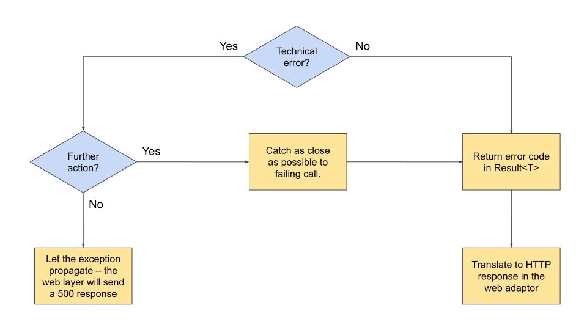

# Reporting and Handling Errors

Exceptions are not type checked.  Code using exceptions is fast in the success path but very slow for failure cases.

Nullable types are type checked, but do not let us return information about an error.

**Therefore**, we use a Result type to report errors that will be handled by code we write.  A Result type is a sealed class hierarchy (aka algebraic data type) that is _either_ a successfully computed value, _or_ a failure described by structured data.

Failures that are explicitly detected by business logic are _always_ returned as a failure case of the Result type.

Technical errors are usually reported by library code throwing exceptions. If they must be handled in our code, we catch them as close the source as possible and translate them into a failure Result.

Technical errors that can be handled by a single point in our system are reported by exceptions.  For example, our HTTP services allow such technical errors to propagate through our code to be caught by the error handler in the Jetty HTTP server and returned to the client as a 500 status. 

## Learn from our mistakes!

A mistake we made early on was to define a common subtype for the error codes.  This lead to lots of functions returning `Result<ErrorCode,T>`, meaning that they could return any kind of error.  Code that processes error codes can no longer rely on the type checker to make sure that all possible errors have been handled.

We should have defined sealed class hierarchies of error codes for bounded contexts within our application, and converted the error codes as they crossed the boundaries of those contexts.

Live and learn...

